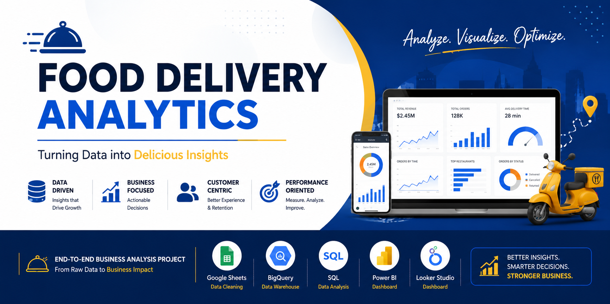
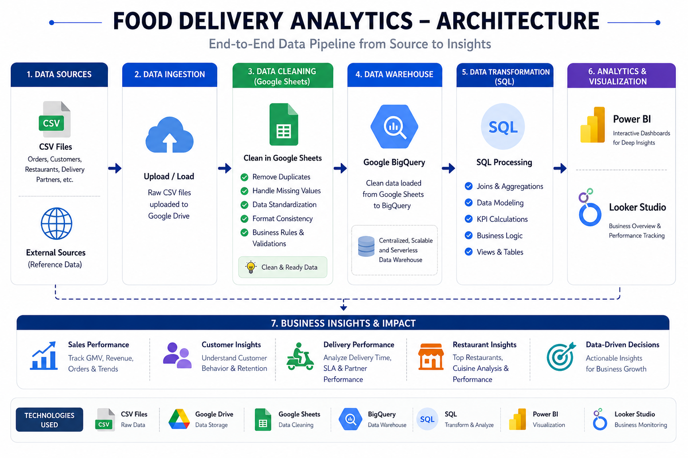
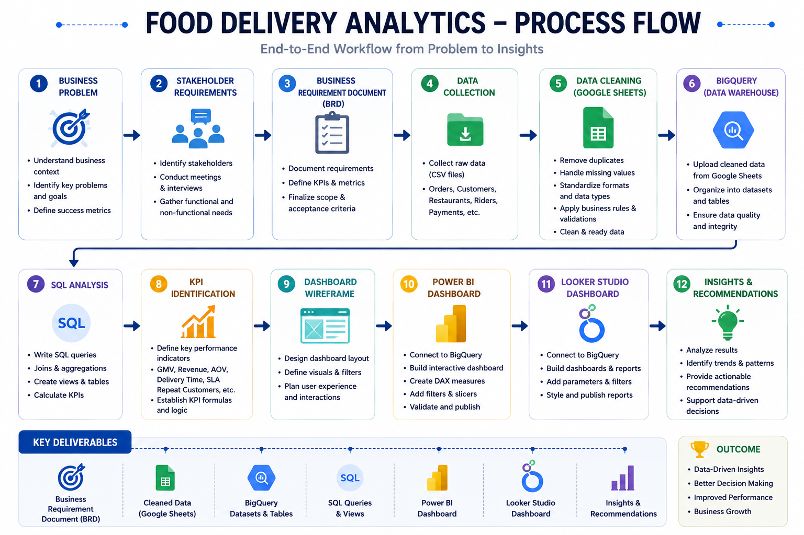
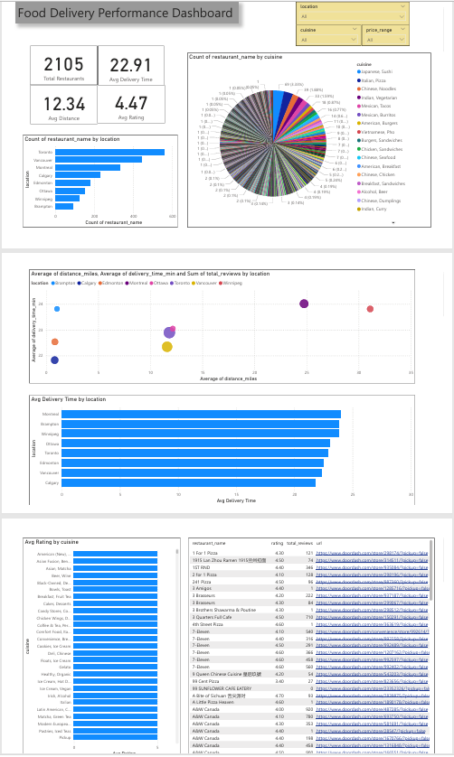

# 🍔 Food & Grocery Delivery Analytics Platform



> **End-to-End Business Analysis • Data Analytics • Cloud Analytics**

## 📌 Project Overview

This repository showcases an end-to-end Food & Grocery Delivery Analytics Platform covering Business Analysis, SQL Analytics, Dashboard Development, BigQuery migration and Looker Studio reporting. It recreates a real-world business scenario using public datasets for portfolio purposes.

## 🏗 Solution Architecture



```text
Raw CSV Files
 -> Google Sheets Cleaning
 -> PostgreSQL
 -> SQL Analytics
 -> Power BI
 -> BigQuery
 -> Google Sheets (Federated)
 -> Looker Studio
```

## 🔄 Workflow



Discovery → BRD → FRD → User Stories → Google Sheets Cleaning → PostgreSQL → Power BI → BigQuery → Looker Studio → Business Insights

## 🛠 Technology Stack

| Area | Tools |
|---|---|
| Business Analysis | Discovery, BRD, FRD, User Stories |
| Agile | Jira, Scrum |
| Process Mapping | Miro |
| Data Cleaning | Google Sheets |
| Database | PostgreSQL |
| Cloud | BigQuery |
| BI | Power BI, Looker Studio |
| Version Control | Git & GitHub |

## 📂 Repository Structure

```text
BA Documents/
BI Documents/
Data/
Query/
images/
README.md
```

## 📄 Business Analysis Deliverables
- Discovery Document
- Stakeholder Register
- User Personas
- As-Is & To-Be Process
- BRD
- FRD
- User Stories
- Acceptance Criteria
- Jira Board
- Sprint Planning
- RACI Matrix
- Miro Diagrams

## 🧹 Data Pipeline
- Public DoorDash Canada datasets
- Grocery dataset
- Google Sheets cleaning
- PostgreSQL analysis
- Power BI reporting
- BigQuery migration
- Looker Studio dashboard

## 🗄 SQL Analytics
Implemented DDL scripts, analytical queries, aggregations, joins, views and KPI calculations for restaurant and grocery analytics.

## 📊 Dashboards




## 📈 Business Insights
- Restaurant performance
- Delivery KPIs
- Customer ratings
- Grocery category analysis
- City-wise trends
- Executive KPI reporting

## 🚀 Skills Demonstrated
Business Analysis, SQL, PostgreSQL, BigQuery, Power BI, Looker Studio, Google Sheets, Jira, Scrum, Miro, Git & GitHub.

## 👨‍💻 Author
**Vibhooti Trivedi**

Business Analyst | Data Analyst

Portfolio project built using publicly available datasets to demonstrate an end-to-end analytics lifecycle while respecting client confidentiality.
